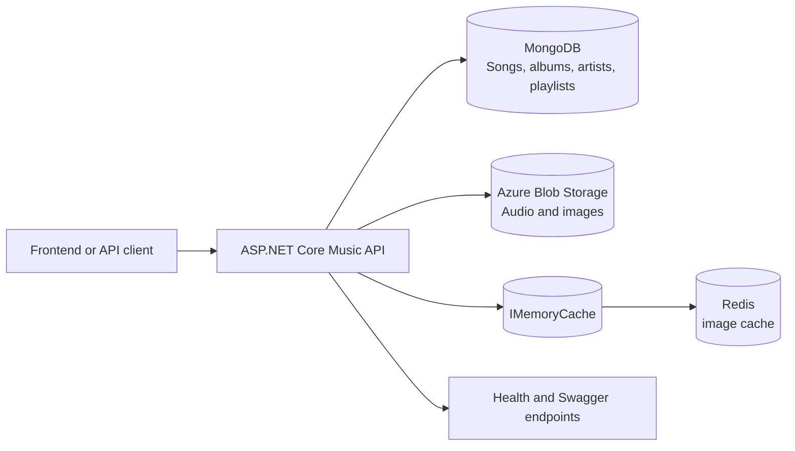

# Music API architecture

## Request flow

1. ASP.NET Core binds configuration from `appsettings*.json` and environment variables.
2. MongoDB is registered as the catalogue store. The service performs a startup ping and exposes `/health/mongodb` for a dependency check.
3. Catalogue controllers read and write MongoDB collections for songs, albums, artists, and playlists.
4. Media controllers use Azure Blob Storage for binary content. Image responses check `IMemoryCache`, then Redis, then Blob Storage; successful reads populate both caches.
5. The API returns HTTP 503 for several dependency failures instead of returning partial catalogue data.

## Cache behaviour observed in code

- Image keys use an `image_` prefix derived from the source URL.
- Redis entries are written with a six-hour expiry.
- In-process entries use a one-hour sliding expiry and the configured memory-cache size limit.
- Redis failures are currently swallowed on the media path so Blob Storage remains the source of truth. This preserves availability but makes cache failures difficult to observe.

## Platform boundaries

The organisation repository layout separates responsibilities:

- `Music`: MongoDB catalogue, Azure Blob media, Redis/media caching.
- `Identity`: PostgreSQL/EF Core identity data, JWT issuance, and migrations.
- `User`: MongoDB user/social data, SignalR hubs, RabbitMQ events, Redis-backed SignalR support, and Azure Blob profile media.
- `Frontend`: Next.js client consuming the three APIs.
- `Infrastructure`: Docker Compose and deployment helper scripts.

This separation is based on the repositories and references in code. It does not by itself prove who operated the Azure virtual machines or production environment.

## Current limitations

- No automated Music API tests are committed.
- Authentication is not configured in the Music API even though write and administrative routes exist.
- The cache-status endpoint currently includes configuration-derived connection information and the cache-clear endpoint is exposed as a GET route; these should be fixed in a separate security PR.
- The repository's CI workflow builds and deploys an image but does not run .NET tests or a dependency audit.
