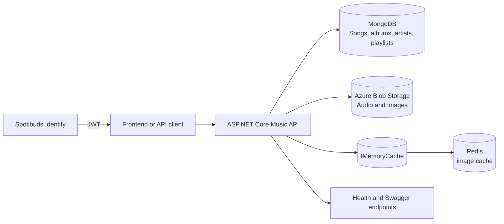

# Music API architecture

## Request flow

1. ASP.NET Core loads settings from `appsettings*.json`, environment variables, and any other configured providers.
2. MongoDB stores songs, albums, artists, and playlists. The service checks MongoDB during startup and through `/health/mongodb`.
3. Azure Blob Storage stores media. Image reads check `IMemoryCache`, then Redis, then Blob Storage, and successful reads populate both caches.
4. JWT bearer authentication validates tokens issued with the same secret, issuer, and audience as the Identity service.
5. Catalogue reads, search, media reads, Swagger, and health checks are public. Admin routes and catalogue writes require the `Admin` role. Playlist changes require the owner or an Admin.
6. Several dependency failures return HTTP 503 rather than partial catalogue data.

## Cache behaviour

- Image keys use an `image_` prefix based on the source URL.
- Redis entries expire after six hours.
- In-process entries use a one-hour sliding expiry and the configured cache size limit.
- If Redis fails during a media request, the service falls back to Blob Storage.

## Other Spotibuds services

- `Music`: MongoDB catalogue, Azure Blob media, and Redis/media caching.
- `Identity`: PostgreSQL/EF Core identity data, JWT issuance, and migrations.
- `User`: user and social features shared across the team project.
- `Frontend`: the Next.js client for the three APIs.
- `Infrastructure`: shared container and deployment configuration.

The Music API repository does not contain the whole Spotibuds system, and the repositories have contributions from several team members.

## Testing and remaining work

The xUnit project covers playlist access decisions and mocked dependency failures. CI builds the service, scans dependencies, packages the image on pull requests, and keeps deployment on pushes to `main`.

End-to-end coverage against disposable MongoDB, Redis, and Blob Storage dependencies is still missing. Cache fallback also needs better monitoring, and nullable-flow warnings remain in some Blob Storage and controller paths.
